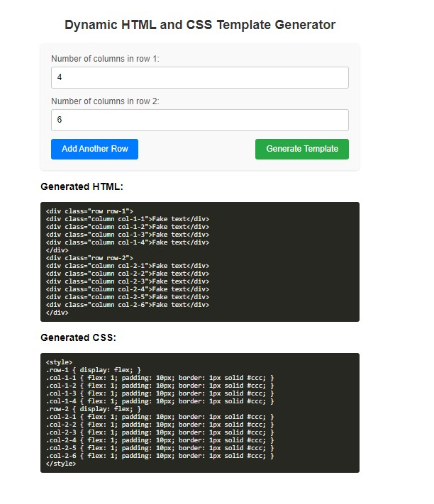

# LayoutGenerator

The **LayoutGenerator** component provides a flexible and interactive layout solution for creating customizable page layouts using Vue.js. It allows users to define the number of columns in each row dynamically and generate a corresponding HTML and CSS layout template.

## Features

- **Dynamic Layout Creation**: Users can specify the number of columns for each row, and the component will generate the corresponding HTML and CSS for the layout.
  
- **Interactive UI**: 
  - **Add New Rows**: Easily add new rows with customizable column counts.
  - **Real-time Updates**: See immediate changes in the layout as you adjust the number of columns.

- **Customizable Styles**:
  - **Column Styling**: Each column in the generated layout has basic styling for padding and borders.
  - **Responsive Design**: The generated layout is flexible and adapts to various screen sizes.

- **Generated Code**:
  - **HTML Template**: Displays the generated HTML code for the layout.
  - **CSS Styles**: Shows the generated CSS styles to replicate the layout design.

- **Copy Code**: Users can easily copy the generated HTML and CSS code for use in other projects.

- **Error Handling**: Ensures that user inputs are validated and that appropriate messages are displayed if any issues arise.

## Usage

1. **Specify Number of Columns**: Enter the number of columns for each row in the form fields.
2. **Add More Rows**: Click the "Add Another Row" button to include additional rows with customizable columns.
3. **Generate Template**: Click the "Generate Template" button to see the generated HTML and CSS code.
4. **Copy Code**: Use the provided code for integration into your projects.

## Example

**Generated HTML:**

```html
<div class="row row-1">
  <div class="column col-1-1">Fake text</div>
  <div class="column col-1-2">Fake text</div>
</div>
<div class="row row-2">
  <div class="column col-2-1">Fake text</div>
  <div class="column col-2-2">Fake text</div>
  <div class="column col-2-3">Fake text</div>
</div>

```
## Screenshot




## Installation

```sh
npm i layoutgenerator

import layoutgenerator from 'layoutgenerator'
import "layoutgenerator/dist/style.css";

<layoutgenerator />


